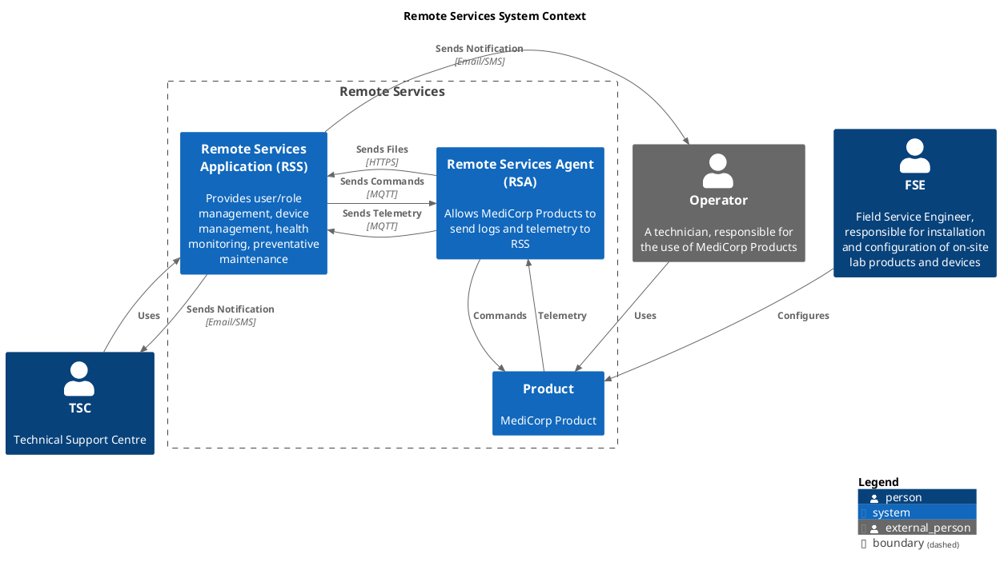

# Context

## Remote Services Agent (RSA)
Remote Services Agent (RSA) is the component that is deployed to the MediCorp Product, and which provides connectivity to the Remote Services Application (RSS).
 
## Remote Services Application (RSS)
Remote Services Application (RSS) is the cloud-based system component of the Remote Services solution.  It is responsible for data capture, processing, and storage.
