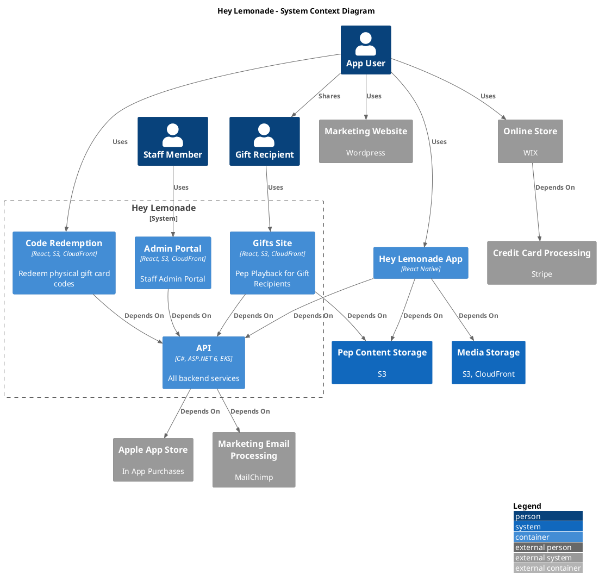

# Context Diagram

```plantuml
@startuml Context

title Hey Lemonade - System Context Diagram

!include <C4/C4_Context>
!include <C4/C4_Container>

LAYOUT_WITH_LEGEND()

Person(staff, "Staff Member")
Person(user, "App User")
Person(recipient, "Gift Recipient")

Container(app, "Hey Lemonade App", "React Native")

System_Boundary(system, "Hey Lemonade") {
    Container(api, "API", "C#, ASP.NET 6, EKS", "All backend services")

    Container(gifts, "Gifts Site", "React, S3, CloudFront", "Pep Playback for Gift Recipients")
    Container(admin, "Admin Portal", "React, S3, CloudFront", "Staff Admin Portal")
    Container(redeem, "Code Redemption", "React, S3, CloudFront", "Redeem physical gift card codes")
}

System(media, "Media Storage", "S3, CloudFront")
System(peps, "Pep Content Storage", "S3")

System_Ext(apple, "Apple App Store", "In App Purchases")
System_Ext(website, "Marketing Website", "Wordpress")
System_Ext(shop, "Online Store", "WIX")
System_Ext(stripe, "Credit Card Processing", "Stripe")
System_Ext(mailchimp, "Marketing Email Processing", "MailChimp")

Rel(staff, admin, "Uses")

Rel(user, app, "Uses")
Rel(user, shop, "Uses")
Rel(user, website, "Uses")
Rel(user, redeem, "Uses")

Rel(user, recipient, "Shares")

Rel(recipient, gifts, "Uses")

Rel(app, api, "Depends On")
Rel(app, media, "Depends On")
Rel(app, peps, "Depends On")

Rel(gifts, api, "Depends On")
Rel(gifts, peps, "Depends On")

Rel(admin, api, "Depends On")
Rel(redeem, api, "Depends On")

Rel(shop, stripe, "Depends On")

Rel(api, apple, "Depends On")
Rel(api, mailchimp, "Depends On")


@enduml
```