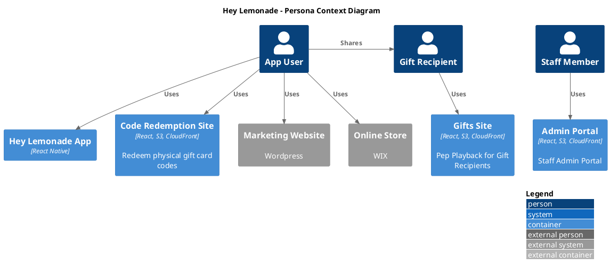

```plantuml
@startuml Context

title Hey Lemonade - Persona Context Diagram

!include <C4/C4_Context>
!include <C4/C4_Container>

LAYOUT_WITH_LEGEND()

Person(staff, "Staff Member")
Person(user, "App User")
Person(recipient, "Gift Recipient")

Container(app, "Hey Lemonade App", "React Native")

Container(gifts, "Gifts Site", "React, S3, CloudFront", "Pep Playback for Gift Recipients")
Container(admin, "Admin Portal", "React, S3, CloudFront", "Staff Admin Portal")
Container(redeem, "Code Redemption Site", "React, S3, CloudFront", "Redeem physical gift card codes")

System_Ext(website, "Marketing Website", "Wordpress")
System_Ext(shop, "Online Store", "WIX")

Rel(staff, admin, "Uses")

Rel(user, app, "Uses")
Rel(user, shop, "Uses")
Rel(user, website, "Uses")
Rel(user, redeem, "Uses")

Rel_R(user, recipient, "Shares")

Rel(recipient, gifts, "Uses")

@enduml
```