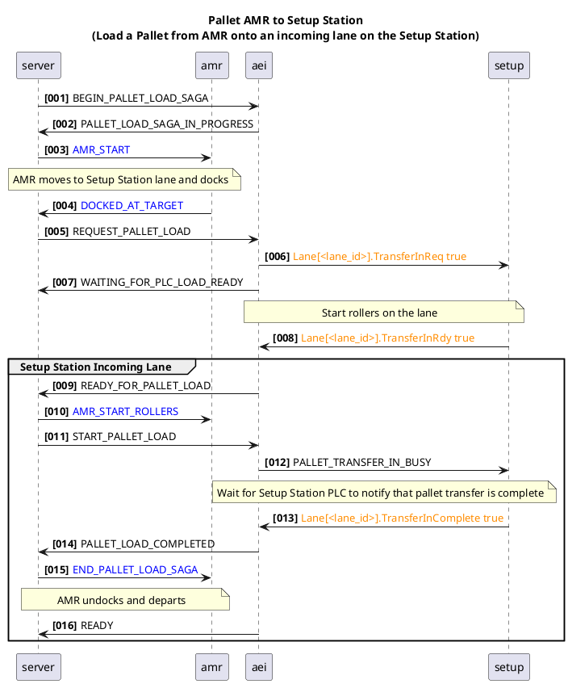

# Equipment Interface

### Colour Key

| Colour | Significance | Protocol |
|---|---|---|
| Blue | AMR | PLC over HTTP | 
| Orange | Setup Station | PLC Over OPC/UA|
| Black | Server to Equipment Interface | MQTT |

## Pallet Transfer Sequence Diagram

