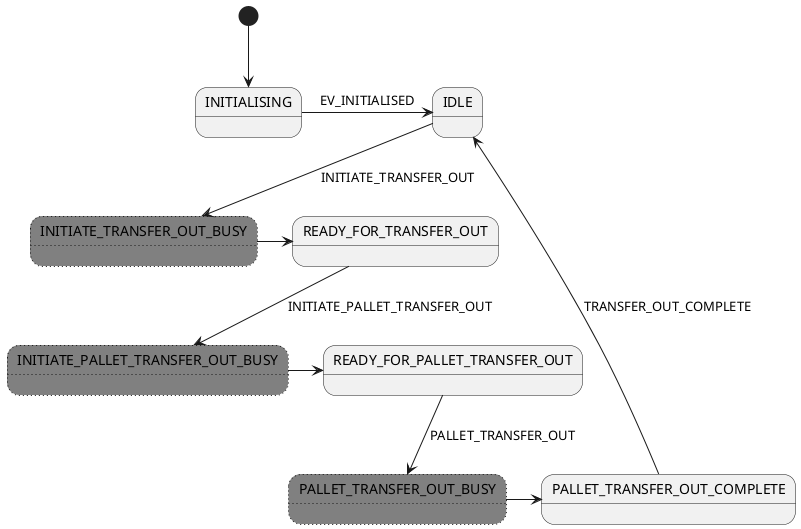

# Equipment Interface

## Transfer Out Sequence

```plantuml
@startuml
[*] --> INITIALISING 

state INITIATE_TRANSFER_OUT_BUSY #gray ##[dotted]
state INITIATE_PALLET_TRANSFER_OUT_BUSY #gray ##[dotted]
state PALLET_TRANSFER_OUT_BUSY #gray ##[dotted]

INITIALISING -> IDLE : EV_INITIALISED

IDLE --> INITIATE_TRANSFER_OUT_BUSY : INITIATE_TRANSFER_OUT
INITIATE_TRANSFER_OUT_BUSY -> READY_FOR_TRANSFER_OUT

READY_FOR_TRANSFER_OUT --> INITIATE_PALLET_TRANSFER_OUT_BUSY : INITIATE_PALLET_TRANSFER_OUT
INITIATE_PALLET_TRANSFER_OUT_BUSY -> READY_FOR_PALLET_TRANSFER_OUT

READY_FOR_PALLET_TRANSFER_OUT --> PALLET_TRANSFER_OUT_BUSY : PALLET_TRANSFER_OUT
PALLET_TRANSFER_OUT_BUSY -> PALLET_TRANSFER_OUT_COMPLETE

PALLET_TRANSFER_OUT_COMPLETE --> IDLE : TRANSFER_OUT_COMPLETE
@enduml
```
