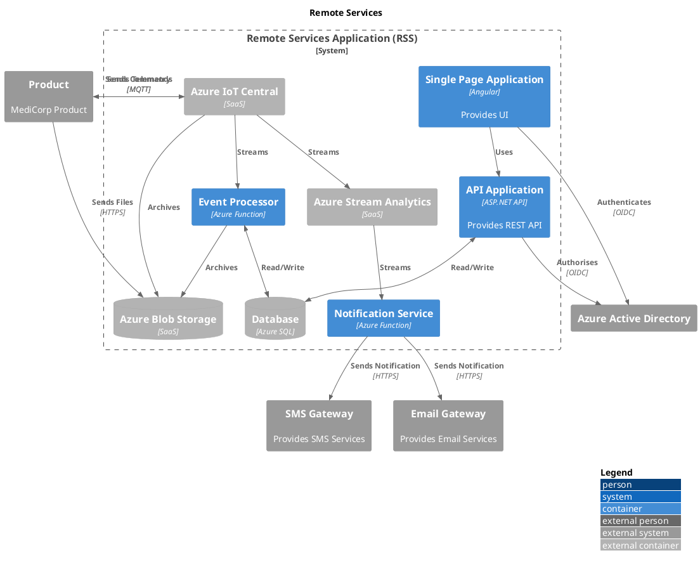

# Remote Service Application

## Event Processor

## Azure Stream Analytics

## Notification Service

## Single Page Application

## API Application

```plantuml
@startuml
!include <C4/C4_Container>

LAYOUT_WITH_LEGEND()

title Remote Services

System_Ext(product, "Product", "MediCorp Product")

System_Boundary(rss_system, "Remote Services Application (RSS)") {
  Container(spa, "Single Page Application", "Angular", "Provides UI")
  Container(api, "API Application", "ASP.NET API", "Provides REST API")
  Container(notification, "Notification Service", "Azure Function", "")
  Container(processor, "Event Processor", "Azure Function", "")

  Container_Ext(iot_central, "Azure IoT Central", "SaaS", "")
  Container_Ext(stream_analytics, "Azure Stream Analytics", "SaaS", "")
  
  ContainerDb_Ext(blob_storage, "Azure Blob Storage", "SaaS", "")
  ContainerDb_Ext(db, "Database", "Azure SQL", "")
}

System_Ext(sms, "SMS Gateway", "Provides SMS Services")
System_Ext(email, "Email Gateway", "Provides Email Services")
System_Ext(aad, "Azure Active Directory", "")

Rel(spa, api, "Uses")
Rel(spa, aad, "Authenticates", "OIDC")

BiRel(api, db, "Read/Write")
Rel(api, aad, "Authorises", "OIDC")

Rel_Neighbor(product, iot_central, "Sends Telemetry", "MQTT")
Rel_Neighbor(product, blob_storage, "Sends Files", "HTTPS")
Rel_Neighbor(iot_central, product, "Sends Commands", "MQTT")

Rel(iot_central, processor, "Streams")
Rel(iot_central, stream_analytics, "Streams")
Rel(stream_analytics, notification, "Streams")
BiRel(processor, db, "Read/Write")

Rel(iot_central, blob_storage, "Archives")
Rel(processor, blob_storage, "Archives")

Rel(notification, sms, "Sends Notification", "HTTPS")

Rel(notification, email, "Sends Notification", "HTTPS")


@enduml

```