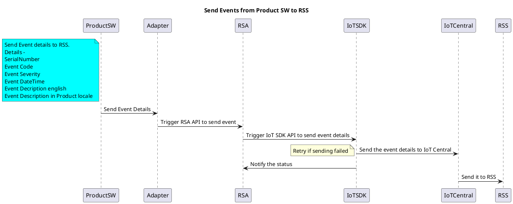
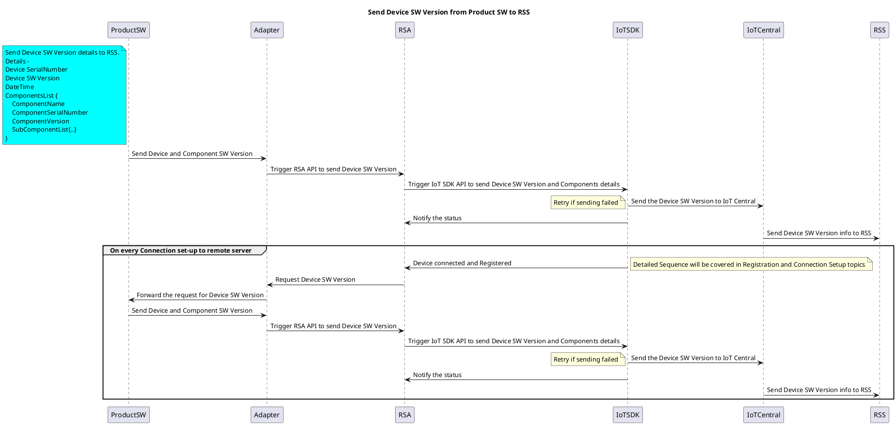

# Sequence Diagram

```plantuml
@startuml
title Send Events from Product SW to RSS
participant ProductSW
participant Adapter
participant RSA
participant IoTSDK
participant IoTCentral
participant RSS

note left of ProductSW #aqua
Send Event details to RSS.
Details -
SerialNumber
Event Code
Event Severity
Event DateTime
Event Decription english
Event Description in Product locale
end note

ProductSW -> Adapter : Send Event Details
Adapter -> RSA : Trigger RSA API to send event
RSA -> IoTSDK : Trigger IoT SDK API to send event details

IoTSDK -> IoTCentral : Send the event details to IoT Central
note left: Retry if sending failed

IoTSDK -> RSA : Notify the status
IoTCentral -> RSS : Send it to RSS
@enduml
```

 
 
 
 

# Sending Device SW Version to RSS

```plantuml
@startuml
title Send Device SW Version from Product SW to RSS
participant ProductSW
participant Adapter
participant RSA
participant IoTSDK
participant IoTCentral
participant RSS

note left of ProductSW #aqua
Send Device SW Version details to RSS.
Details -
Device SerialNumber
Device SW Version
DateTime
ComponentsList {
    ComponentName
    ComponentSerialNumber
    ComponentVersion
    SubComponentList{..}
}
end note

ProductSW -> Adapter : Send Device and Component SW Version
Adapter -> RSA : Trigger RSA API to send Device SW Version
RSA -> IoTSDK : Trigger IoT SDK API to send Device SW Version and Components details

IoTSDK -> IoTCentral : Send the Device SW Version to IoT Central
note left: Retry if sending failed

IoTSDK -> RSA : Notify the status
IoTCentral -> RSS : Send Device SW Version info to RSS


group On every Connection set-up to remote server
IoTSDK -> RSA : Device connected and Registered
note right: Detailed Sequence will be covered in Registration and Connection Setup topics
RSA -> Adapter : Request Device SW Version
Adapter -> ProductSW : Forward the request for Device SW Version


ProductSW -> Adapter : Send Device and Component SW Version
Adapter -> RSA : Trigger RSA API to send Device SW Version
RSA -> IoTSDK : Trigger IoT SDK API to send Device SW Version and Components details

IoTSDK -> IoTCentral : Send the Device SW Version to IoT Central
note left: Retry if sending failed

IoTSDK -> RSA : Notify the status
IoTCentral -> RSS : Send Device SW Version info to RSS
end

@enduml
```
