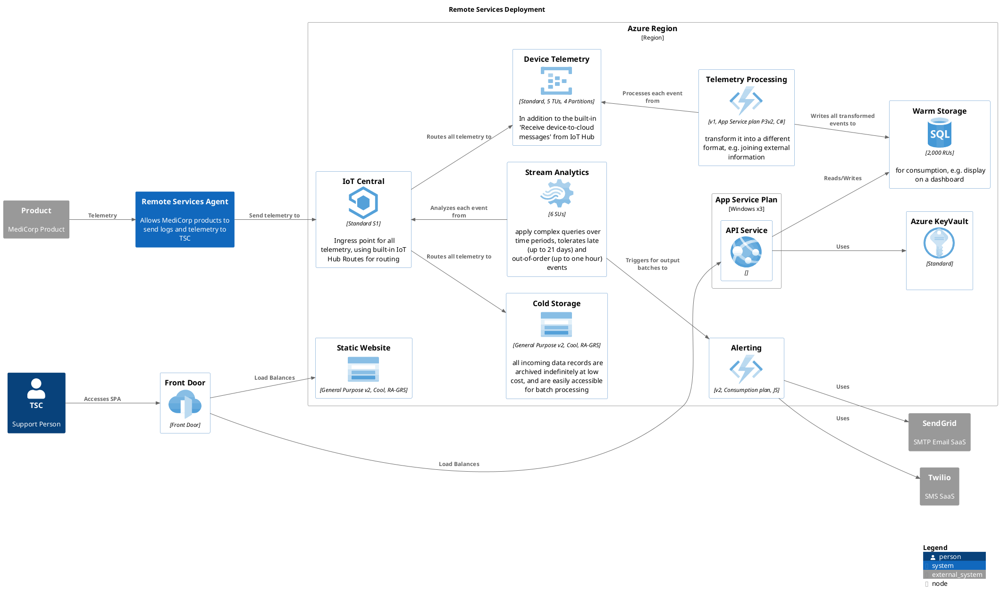

**Deployment diagram**

## INFRASTRUCTURE AUTOMATION
The cloud infrastructure upon which the RSS runs will be deployed using Terraform.  Terraform allows for the storage of infrastructure as code artefacts in a source code repository, offering the same level of peer review tools that are used in a software development repository.

Terraform has the benefit of being used by other teams within MediCorp already and provides a common language for infrastructure automation regardless of the cloud platform used.  Terraform has been selected due to the language structure, ability to easily introduce conditional steps, and the shallow learning curve.  
There are some Azure resources which cannot be managed by Terraform at this time, Front Door is one of them.  For these scenarios either ARM, Bicep or PowerShell can be used until such time that Terraform consistently supports them.

## DEPLOYMENT AUTOMATION
Azure DevOps will be used to automate the build and deployment of application software into Azure.  Builds will automatically be triggered upon code check-in and deployments can then be triggered based upon the successful completion of a build.  Optionally, these built artefacts can also be deployed in a more manual process for more controlled environments such as production.

