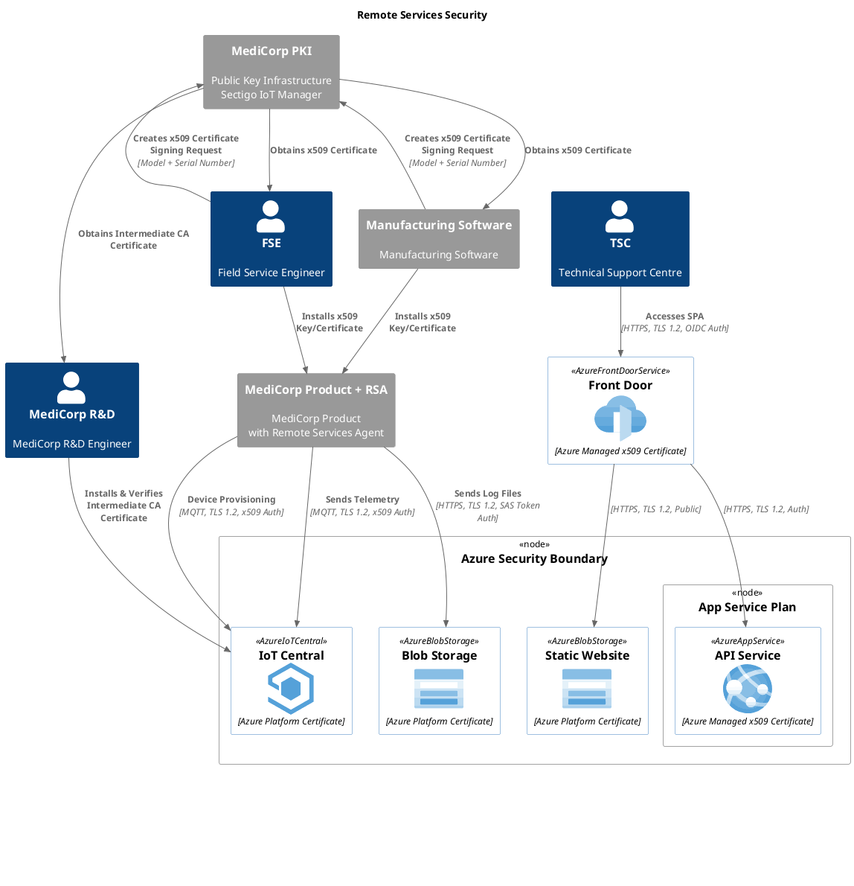

# Security Controls

The Security View aims to show the solution-level security controls in place between the Remote Service solution and external entities.  It does not show the internal security controls between the various cloud components.

In the context of the following sections the term "Device" will be used to describe "MediCorp Products".  This is to align with the "Device" terminology used in Microsoft and other referenced documentation.

The diagram outlines the internet/public facing aspects of the security design of the Remote Services solution.  It deliberately does not include any of the detail between components within the Azure cloud platform.

## Device Security Controls

Only authenticated devices may connect to the RSS cloud component.  This access is managed through x509 certificate authentication provided by IoT Central.

The detailed process for IoT Central configuration and MediCorp Product provisioning of these x509 certificates is outlined in the [PKI](pki.md) section.

### Device to Cloud Authentication

*Requirement: Only Trusted Devices may connect to IoT Central*

IoT Central ensures that only valid devices can connect by validating that the device-provided x509 certificate has been issued by a trusted private Issuing CA.  The trusted Issuing CA certificates are managed within IoT Central and will be configured by the Remote Services R&D team at the time of setup.

Reference: https://docs.microsoft.com/en-us/azure/iot-hub/iot-hub-x509ca-overview#authenticating-devices-signed-with-x509-ca-certificates
Reference: https://docs.microsoft.com/en-us/azure/iot-dps/concepts-x509-attestation

### Cloud to Device Authentication

*Requirement: Devices may only connect to Trusted IoT Central instances*

IoT Central requires that Issuing CA certificates are verified to prove ownership.  This prevents devices from inadvertently connecting to an invalid IoT Central instance.  The proof of ownership is achieved by having the Issuing CA issue a certificate in response to a challenge code generated by IoT Central. 

In the absence of a Verified Certificate in IoT Central, a device will fail to create an authenticated TLS connection to the IoT Central endpoint, ensuring that MediCorp Products will not accidentally (or maliciously) connect to an invalid IoT Central instance.

From the Microsoft documentation on this topic:

> Verified certificates play an important role when using enrollment groups. Verifying certificate ownership provides an additional security layer by ensuring that the uploader of the certificate is in possession of the certificate's private key. Verification prevents a malicious actor sniffing your traffic from extracting an intermediate certificate and using that certificate to create an enrollment group in their own provisioning service, effectively hijacking your devices. By proving ownership of the root or an intermediate certificate in a certificate chain, you're proving that you have permission to generate leaf certificates for the devices that will be registering as a part of that enrollment group. For this reason, the root or intermediate certificate configured in an enrollment group must either be a verified certificate or must roll up to a verified certificate in the certificate chain a device presents when it authenticates with the service.  
> 
> Reference: https://docs.microsoft.com/en-us/azure/iot-dps/how-to-verify-certificates

