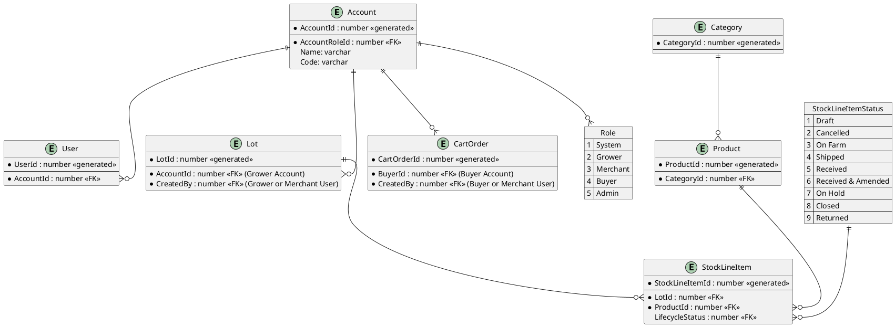

# Database Model

```plantuml
@startuml

entity "Account" as account {
  *AccountId : number <<generated>>
  --
  *AccountRoleId : number <<FK>>
  Name: varchar
  Code: varchar
}

entity "User" as user {
  *UserId : number <<generated>>
  --
  *AccountId : number <<FK>>
}

entity "Lot" as lot {
  *LotId : number <<generated>>
  --
  *AccountId : number <<FK>> (Grower Account)
  *CreatedBy : number <<FK>> (Grower or Merchant User)
}

entity "CartOrder" as cartorder {
  *CartOrderId : number <<generated>>
  --
  *BuyerId : number <<FK>> (Buyer Account)
  *CreatedBy : number <<FK>> (Buyer or Merchant User)
}

entity "Product" as product {
  *ProductId : number <<generated>>    
  --
  *CategoryId : number <<FK>>    
}

entity "Category" as category {
  *CategoryId : number <<generated>>    
  --
}

entity "StockLineItem" as stocklineitem {
  *StockLineItemId : number <<generated>>
  --
  *LotId : number <<FK>>    
  *ProductId : number <<FK>>
  LifecycleStatus : number <<FK>>
}


map "Role" as role {
 1 => System
 2 => Grower
 3 => Merchant
 4 => Buyer
 5 => Admin
}

map "StockLineItemStatus" as stocklineitemstatus {
    1 => Draft
    2 => Cancelled
    3 => On Farm
    4 => Shipped
    5 => Received
    6 => Received & Amended
    7 => On Hold
    8 => Closed
    9 => Returned
}

category ||--o{ product

product ||--o{ stocklineitem::ProductId

account ||--o{ lot::AccountId
account ||--o{ cartorder::AccountId
account ||--o{ user::AccountId

account ||--o{ role

lot::LotId ||--o{ stocklineitem::LotId 

stocklineitemstatus ||--o{ stocklineitem::LifecycleStatus

@enduml
```
